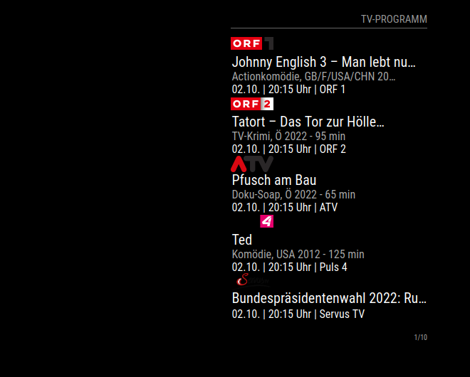
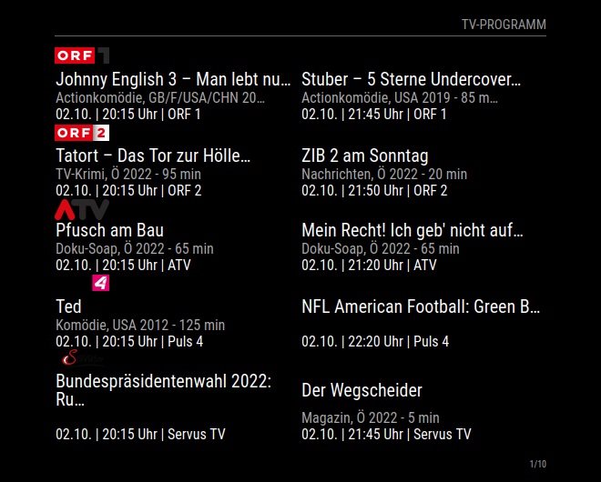

# MMM-TV-Program
This is an extension for the [MagicMirror](https://github.com/MichMich/MagicMirror). It displays todays Austrian prime time TV shows.

The module scans the Austrian TV program site [tele.at](https://www.tele.at) for TV shows at prime time (20:15) and displays the results according to the module's option settings.

## Screenshots

<br>*Exemplary TV program (prime show only)*
<br>*Exemplary TV program (prime show and show afterwards)*


## Installation

Navigate into your MagicMirror's `modules` folder and execute `git clone https://github.com/Strifus/MMM-TV-Program.git`.

## Using the module

To use this module, add it to the modules array in the `config/config.js` file:
````javascript
modules: [
	{
		module: 'MMM-TV-Program',
		config: {
			// See 'Configuration options' for more information.
		}
	}
]
````

With the default URL 50 stations will be scraped from [tele.at](https://www.tele.at). Since this would be too much for one single page to display, the stations are displayed on multiple pages. A mechanism to scroll through the pages automatically is implemented. The mechanism can be configured by the configuration properties.

## Configuration Options

The following properties can be configured:

<table width="100%">
	<thead>
		<tr>
			<th>Option</th>
			<th width="100%">Description</th>
		</tr>
	<thead>
	<tbody>
		<tr>
			<td><code>url</code></td>
			<td>URL of the tele.at site with the TV program.<br>
			    <b>Default value:</b> <code>https://www.tele.at/tv-programm/2015-im-tv.html?stationType=-1</code>
			</td>
		</tr>
		<tr>
			<td><code>stationsPerPage</code></td>
			<td>Number of stations to show at once (i.e. per page)<br>
			    <b>Default value:</b> <code>4</code>
			</td>
		</tr>
        <tr>
			<td><code>showNext</code></td>
			<td>Flag whether show after prime show should be displayed.<br>
			    <b>Default value:</b> <code>true</code>
			</td>
		</tr>
		<tr>
			<td><code>showIndex</code></td>
			<td>Flag whether current page index should be displayed.<br>
			    <b>Default value:</b> <code>true</code>
			</td>
		</tr>
		<tr>
			<td><code>animationSpeed</code></td>
			<td>Fading time between two pages.<br>
			    <b>Default value:</b> <code>1.0 * 1000</code>
			</td>
		</tr>
		<tr>
			<td><code>reloadInterval</code></td>
			<td>Time interval for scraping the URL.<br>
			    <b>Default value:</b> <code>30 * 60 * 1000</code>
			</td>
		</tr>
		<tr>
			<td><code>updateInterval</code></td>
			<td>Time interval between two pages.<br>
			    <b>Default value:</b> <code>10 * 1000</code>
			</td>
		</tr>
		<tr>
			<td><code>lengthTitle</code></td>
			<td>Maximum character length of title before it gets shortened/wrapped.<br>
			    <b>Default value:</b> <code>30</code>
			</td>
		</tr>
		<tr>
			<td><code>lengthGenre</code></td>
			<td>Maximum character length of genre before it gets shortened.<br>
			    <b>Default value:</b> <code>30</code>
			</td>
		</tr>
		<tr>
			<td><code>wrapTitle</code></td>
			<td>Flag whether title should be wrapped in case of maximum character length exceedance.<br>
			    <b>Default value:</b> <code>false</code>
			</td>
		</tr>
		<tr>
			<td><code>linesTitle</code></td>
			<td>Maximum number of lines title is allowed to occupy in case of wrapping.<br>
			    <b>Default value:</b> <code>1</code>
			</td>
		</tr>
	</tbody>
</table>

## Example

To use this module, add it to the modules array in the `config/config.js` file:
````javascript
modules: [
    {
        module: 'MMM-TV-Program',
        header: 'TV-Programm',
        position: 'top_right',
        config: {
                stationsPerPage: 5,
                showNext: true,
                showIndex: true,
                animationSpeed: 1000,
                reloadInterval: 30 * 6 * 1000,
                updateInterval: 10 * 1000
        }
    },
]
````


The MIT License (MIT)
=====================

Copyright © 2022 Strifus

Permission is hereby granted, free of charge, to any person
obtaining a copy of this software and associated documentation
files (the “Software”), to deal in the Software without
restriction, including without limitation the rights to use,
copy, modify, merge, publish, distribute, sublicense, and/or sell
copies of the Software, and to permit persons to whom the
Software is furnished to do so, subject to the following
conditions:

The above copyright notice and this permission notice shall be
included in all copies or substantial portions of the Software.

**The software is provided “as is”, without warranty of any kind, express or implied, including but not limited to the warranties of merchantability, fitness for a particular purpose and noninfringement. In no event shall the authors or copyright holders be liable for any claim, damages or other liability, whether in an action of contract, tort or otherwise, arising from, out of or in connection with the software or the use or other dealings in the software.**
